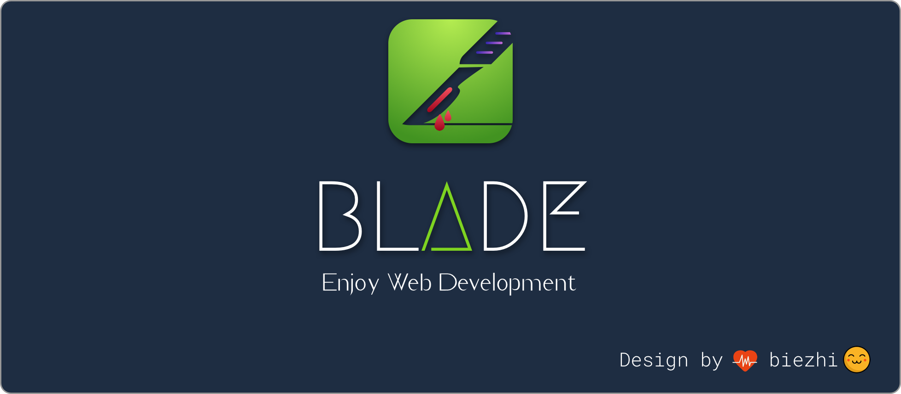

   
  
   
   

## Awesome Blade 

> A curated list of awesome things related to Blade

- [Projects Using Blade](#projects-using-blade)
  - [Open Source](#open-source)
  - [Commercial Products](#commercial-products)
  - [Websites](#appswebsites)
  - [Enterprise Usage](#enterprise-usage)
- [Examples](#examples) 
- [Third-party Integration](#third-party-integration)
  - [Database](#database)
  - [Template](#template)
  - [JSON Support](#json-support)
- [Other Tools](#other-tools)
  - [Command Line](#command-line)
  - [Generator](#generator)
  
# Projects Using Blade

## Open Source

- [tale](https://github.com/otale/tale) - Best beautiful java blog, based on Blade.
- [geek-dev](https://github.com/biezhi/geek-dev) - Simple developer forum system.
- [freechat](https://github.com/biezhi/freechat) - Online chat site anonymous
- [nice](https://github.com/biezhi/nice) - Picture social networking site
- [oh-mybatis](https://github.com/biezhi/oh-mybatis) - Web-generated mybatis code generator
- [grice](https://github.com/biezhi/grice) - Use markdown to render the document
- [bye-2017](https://github.com/biezhi/bye-2017) - Bye! my 2017
- [bing-wallpaper](https://github.com/vpday/bing-wallpaper) - Daily collection Bing Wallpaper

# Examples

- [blade-helloworld](https://github.com/lets-blade/blade-demos/tree/master/blade-helloworld)
- [blade-upload](https://github.com/lets-blade/blade-demos/tree/master/blade-upload)
- [blade-ajax](https://github.com/lets-blade/blade-demos/tree/master/blade-ajax)
- [blade-route](https://github.com/lets-blade/blade-demos/tree/master/blade-route)
- [blade-template](https://github.com/lets-blade/blade-demos/tree/master/blade-template)
- [blade-vue-todolist](https://github.com/lets-blade/blade-demos/tree/master/blade-vue-todolist)
- [blade-package](https://github.com/lets-blade/blade-demos/tree/master/blade-package)
- [blade-custom-banner](https://github.com/lets-blade/blade-demos/tree/master/blade-custom-banner)
- [blade-task](https://github.com/lets-blade/blade-demos/tree/master/blade-task)
- [blade-kit-example](https://github.com/lets-blade/blade-demos/tree/master/blade-kit-example/src/main/java/com/blade/demo/kit)

## Commercial Products

## Websites

- https://findor.me
- https://geek-dev.club
- https://fangfang.ink
- https://www.myann.cn/
- http://116.196.122.228:9000/
- https://www.devtool.top/
- http://sunzhenyu.net/
- http://ranshaoba.xyz/
- http://www.moretime.vip/
- http://www.itviki.com/
- https://www.datayang.com/
- http://maruifu.cn/
- http://jaytang.me/
- http://twojz.top/
- https://www.zhangaoo.com/
- https://tuzhao.org/

## Enterprise Usage

- PingAn

# Third-party Integration

## Database

- [anima](https://github.com/biezhi/anima) - minimal database operation library. 

## Template

- [Jetbrick Templte](https://github.com/lets-blade/blade-template-engines/tree/master/blade-template-jetbrick) - Jetbrick template engine support
- [Pebble Templte](https://github.com/lets-blade/blade-template-engines/tree/master/blade-template-pebble) - Pebble template engine support
- [Velocity Templte](https://github.com/lets-blade/blade-template-engines/tree/master/blade-template-velocity) - Velocity template engine support
- [Freemarker Templte](https://github.com/lets-blade/blade-template-engines/tree/master/blade-template-freemarker) - Freemarker template engine support

## JSON Support

- [FastJSON Support](https://github.com/lets-blade/blade-json-support/tree/master/blade-fastjson-support) - Use fastjson as the default JSON support
- [Jackson Support](https://github.com/lets-blade/blade-json-support/tree/master/blade-jackson-support) - Use jackson as the default JSON support
- [GSON Support](https://github.com/lets-blade/blade-json-support/tree/master/blade-gson-support) - Use gson as the default JSON support

# Other Tools

## Command Line

- [blade-cli](https://github.com/biezhi/blade-cli) - Generate the project under the command line skeleton, packaged, run, use the go language

## Generator

- [codegen](https://github.com/lets-blade/codegen) - Help generate a project skeleton, including template configuration and database entities

